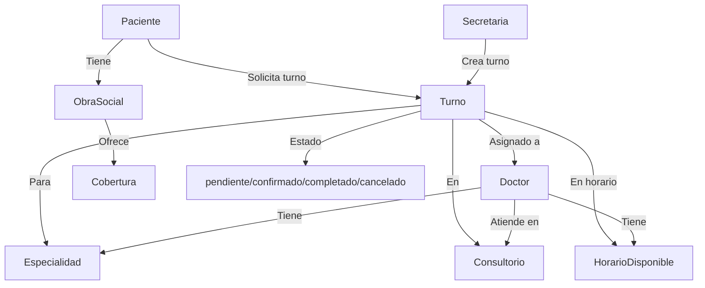

## Diagrama de relaciones y flujo de turnos



**Flujo resumido:**

1. Paciente o secretaria solicita/crea un turno.
2. El turno se asocia a un doctor, especialidad, consultorio y horario disponible.
3. El turno pasa por los estados: pendiente → confirmado → completado/cancelado.
4. Los roles (admin, doctor, secretaria, paciente) pueden interactuar según sus permisos.
## Funcionamiento de turnos y horarios

### Relación entre turnos y horarios

- Cada **turno** está asociado a un doctor, un paciente, un consultorio, una especialidad y un horario disponible.
- Los **horarios disponibles** definen los días y franjas horarias en que un doctor atiende en un consultorio.
- Al crear un turno, el sistema valida que el doctor esté disponible en ese horario y consultorio, y que no haya superposición con otros turnos.
- Los turnos pueden tener los siguientes estados: `pendiente`, `confirmado`, `completado`, `cancelado`.
- Los turnos pueden ser confirmados, cancelados o completados según el rol y el flujo de trabajo.

### ¿Qué puede hacer cada usuario?

**ADMIN:**
- Crear, ver, actualizar y eliminar turnos de cualquier paciente o doctor
- Confirmar, cancelar y completar cualquier turno
- Gestionar usuarios, doctores, pacientes, consultorios, especialidades, obras sociales y horarios

**DOCTOR:**
- Ver solo sus propios turnos y horarios
- Confirmar, cancelar y completar sus turnos
- Crear y editar pacientes

**SECRETARIA:**
- Crear, ver, actualizar y eliminar turnos de cualquier paciente o doctor
- Confirmar y cancelar turnos
- Gestionar pacientes, doctores, consultorios, obras sociales y horarios

**PACIENTE:**
- Ver y crear sus propios turnos
- Cancelar sus turnos
- Ver detalles de sus turnos y horarios asignados

### Ejemplo de flujo de turnos

1. Un paciente o secretaria solicita un turno para un doctor, especialidad y consultorio en un horario disponible.
2. El sistema valida la disponibilidad y crea el turno en estado `pendiente`.
3. El turno puede ser confirmado por un admin, secretaria o doctor.
4. El paciente puede cancelar su turno antes de la fecha.
5. El doctor o secretaria puede marcar el turno como `completado` una vez atendido.
git clone <url-del-repositorio>


# 🏥 Sistema de Gestión de Turnos Médicos - Backend

Backend desarrollado en **NestJS** con **TypeORM** y **MySQL** para la gestión integral de turnos médicos.

## ¿Qué permite hacer este backend?

Este sistema permite:

- Autenticación y autorización de usuarios mediante JWT
- Administración de 4 roles: **admin**, **doctor**, **secretaria** y **paciente**
- Gestión completa de turnos médicos: crear, listar, actualizar, confirmar, cancelar, completar y eliminar turnos
- Administración de pacientes: alta, edición, baja y consulta de pacientes, con soporte de obras sociales y coberturas
- Administración de doctores: alta, edición, baja, asignación de especialidades y horarios disponibles
- Gestión de especialidades médicas
- Gestión de consultorios y sus horarios disponibles
- Administración de obras sociales y coberturas
- Validación automática de datos y relaciones entre entidades
- Soporte para seeders de datos iniciales y scripts automáticos de base de datos

Ideal para clínicas, consultorios o instituciones que requieran un sistema robusto y seguro para la gestión de turnos médicos y administración de usuarios.

## 🚀 Instalación y uso rápido

### 1. Clonar el repositorio e instalar dependencias

```bash
git clone <url-del-repositorio>
cd be_turnera
npm install
```

### 2. Crear la base de datos

Puedes usar los scripts en `src/database` para crear la base de datos automáticamente según tu sistema operativo, o ejecutar el SQL manualmente:

```bash
# Windows (CMD)
cd src/database
create-db.bat

# Linux/Mac
cd src/database
chmod +x create-db.sh
./create-db.sh
```

O bien:

```bash
mysql -u root -p < src/database/create-database.sql
```

### 3. Configurar variables de entorno

Copia el archivo de ejemplo y edítalo con tus credenciales:

```bash
cp .env.example .env
```

Variables principales:

```env
DB_HOST=localhost
DB_PORT=3306
DB_USERNAME=root
DB_PASSWORD=tu_contraseña_mysql
DB_DATABASE=turnera
PORT=3000
JWT_SECRET=tu_secreto_super_seguro_aqui
JWT_EXPIRATION=24h
```

### 4. Iniciar la aplicación

```bash
npm run start:dev
# La API estará disponible en: http://localhost:3000/api
```

---

## 📄 Descripción

Este backend permite:
- Autenticación y autorización con JWT
- Gestión de usuarios, doctores, pacientes, turnos, especialidades, obras sociales, consultorios y horarios
- Administración de roles (admin, doctor, secretaria, paciente)
- Validación y relaciones entre entidades

Para más detalles, revisa el código fuente y los scripts incluidos.
