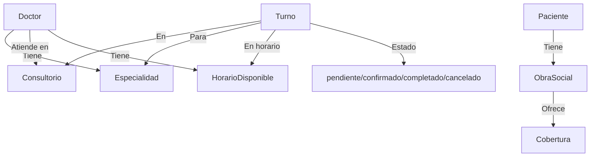

# 🏥 Sistema de Gestión de Turnos Médicos - Backend

Backend desarrollado en **NestJS** con **TypeORM** y **MySQL** para la gestión integral de turnos médicos.
- [Diagrama de relaciones y flujo de turnos](#diagrama-de-relaciones-y-flujo-de-turnos)
- [Funcionamiento de turnos y horarios](#funcionamiento-de-turnos-y-horarios)


## 📄 Descripción

Este backend permite:

- Autenticación y autorización de usuarios mediante JWT
- Administración de 4 roles: **admin**, **doctor**, **secretaria** y **paciente**
- Gestión completa de turnos médicos: crear, listar, actualizar, confirmar, cancelar, completar y eliminar turnos
- Administración de pacientes: alta, edición, baja y consulta de pacientes, con soporte de obras sociales y coberturas
- Administración de doctores: alta, edición, baja, asignación de especialidades y horarios disponibles
- Gestión de especialidades médicas
- Gestión de consultorios y sus horarios disponibles
- Administración de obras sociales y coberturas
- Validación automática de datos y relaciones entre entidades
- Soporte para seeders de datos iniciales y scripts automáticos de base de datos


## 🚀 Instalación y uso rápido

### 1. Clonar el repositorio e instalar dependencias

```bash
git clone <url-del-repositorio>
cd be_turnera
npm install
```

### 2. Crear la base de datos

Puedes usar los scripts en `src/database` para crear la base de datos automáticamente según tu sistema operativo, o ejecutar el SQL manualmente:

```bash
# Windows (CMD)
cd src/database
create-db.bat

# Linux/Mac
cd src/database
chmod +x create-db.sh
./create-db.sh
```

O bien:

```bash
mysql -u root -p < src/database/create-database.sql
```

### 3. Configurar variables de entorno

Copia el archivo de ejemplo y edítalo con tus credenciales:

```bash
cp .env.example .env
```


```env
DB_HOST=localhost
DB_PORT=3306
DB_USERNAME=root
DB_PASSWORD=tu_contraseña_mysql
DB_DATABASE=turnera
PORT=3000
JWT_SECRET=tu_secreto_super_seguro_aqui
### 4. Iniciar la aplicación

```bash
npm run start:dev
# La API estará disponible en: http://localhost:3000/api
```

---


## Endpoint de Logs de Errores y Warnings (Solo Admin)

El sistema registra automáticamente todos los errores y advertencias en el archivo `logs/app.log`.

### Consultar logs desde la API

El endpoint `/logs` permite a los administradores consultar los logs de la aplicación:

- **Ruta:** `GET /logs`
- **Autenticación:** Requiere token JWT de admin
- **Parámetros:**
  - `limit` (opcional, número): cantidad máxima de líneas a mostrar (por defecto 100)

#### Ejemplo de uso

GET /logs?limit=50
Authorization: Bearer <token-admin>
```

#### Respuesta

```json
{
  "logs": [
    // ...
  ]
}
```


Solo los usuarios con rol **admin** pueden acceder a este endpoint. Si un usuario sin permisos intenta acceder, recibirá un error 403.


## Lógica de Soft Delete y Recuperación (Admin Only)


### ¿Cómo funciona el Soft Delete?

En este sistema, las entidades principales (`Usuario`, `Paciente`, `Doctor`, `Consultorio`, `Turno`) implementan **borrado lógico** mediante un campo `activo: boolean`. Cuando un registro es eliminado, simplemente se marca como `activo: false` en vez de eliminarse físicamente de la base de datos. Esto permite mantener la integridad de los datos y la trazabilidad de los registros.


### Visibilidad de registros inactivos

- **Usuarios comunes**: Solo pueden ver y operar sobre registros activos (`activo: true`). Los registros inactivos no aparecen en los endpoints GET ni pueden ser modificados por usuarios que no sean administradores.


### Endpoints especiales para administradores

Cada módulo principal expone dos endpoints adicionales, accesibles solo para administradores:

- `GET /[entidad]/inactivos`: Lista todos los registros inactivos de la entidad.
- `PATCH /[entidad]/{id}/restaurar`: Restaura un registro inactivo, marcándolo nuevamente como activo.

**Ejemplo:**

- `GET /usuario/inactivos` (solo admin)
- `PATCH /usuario/5/restaurar` (solo admin)

Estos endpoints requieren autenticación y el rol de administrador. Si un usuario sin permisos intenta acceder, recibirá un error 403.


### Ejemplo de flujo de borrado y restauración

1. Un usuario elimina un registro: el campo `activo` pasa a `false`.
2. El registro desaparece de los listados para usuarios comunes.
3. Un administrador puede ver el registro en `/inactivos` y restaurarlo con `/restaurar`.
4. El registro vuelve a estar disponible para todos.


### Swagger y documentación

Todos los endpoints relacionados con soft delete y restauración están documentados en Swagger, incluyendo ejemplos de respuesta y restricciones de acceso.


---




**Flujo resumido:**

1. Paciente o secretaria solicita/crea un turno.
2. El turno se asocia a un doctor, especialidad, consultorio y horario disponible.
3. El turno pasa por los estados: pendiente → confirmado → completado/cancelado.
4. Los roles (admin, doctor, secretaria, paciente) pueden interactuar según sus permisos.


## Funcionamiento de turnos y horarios

### Relación entre turnos y horarios

### ¿Qué puede hacer cada usuario?


**ADMIN:**

- Crear, ver, actualizar y eliminar turnos de cualquier paciente o doctor
- Confirmar, cancelar y completar cualquier turno
- Gestionar usuarios, doctores, pacientes, consultorios, especialidades, obras sociales y horarios

**DOCTOR:**

- Ver y crear sus propios turnos
- Cancelar sus turnos
- Ver detalles de sus turnos y horarios asignados


### Ejemplo de flujo de turnos

1. Un paciente o secretaria solicita un turno para un doctor, especialidad y consultorio en un horario disponible.
2. El sistema valida la disponibilidad y crea el turno en estado `pendiente`.
3. El turno puede ser confirmado por un admin, secretaria o doctor.
4. El paciente puede cancelar su turno antes de la fecha.
5. El doctor o secretaria puede marcar el turno como `completado` una vez atendido.
